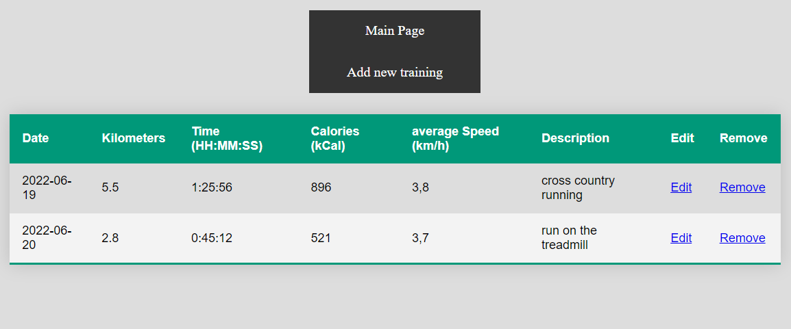

# News Articles App

## General Information
The small app, which allows users to record their running trainings and review them.

## Screenshots

### Form add training

### Trainings list

## Technologies Used
- Java
- Spring
- Hibernate
- H2
- HTML
- CSS

## Features
- form add new training
- table with data of trainings
- navigation buttons
- edit button for each training
- delete button for each training

### Functions
- calculate average speed
- add new training to database
- edition of trainings data 
- delete of training
- display a list of trainings data

## Usage
Run main method in TrainingRecorderAppApplication class and enter "localhost:8080" to browser window.